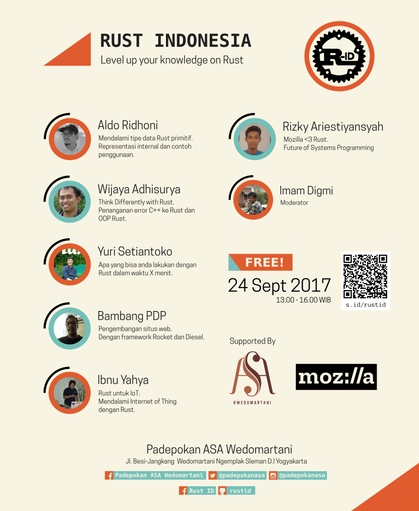

# Judul
Level Up Your Knowledge on Rust

# Narasumber

1. Bambang Purnomosidi D. P [@bpdp](https://github.com/bpdp) (Membangun Aplikasi Web Menggunakan Rocket + Diesel)
2. Ibnu Yahya [@anak10thn](https://github.com/anak10thn) (Rust untuk IoT)
3. Yuri Setiantoko [@zerosign](https://github.com/zerosign) (Apa yang anda bisa lakukan dengan Rust dalam 15 menit)
4. Aldo Ridhoni [@aldoridhoni](https://github.com/aldoridhoni) (Mendalami tipe data primitif di Rust)
5. Wijaya Adhisurya [@wijaya_as](https://github.com/wijaya_as) (Penanganan error C++ ke Rust dan OOP Rust)

> Silahkan melihat ke masing-masing direktori untuk melihat slide dan mungkin juga contoh implementasi dari presentasi masing-masing presenter.

# Moderator

Imam Digmi [@imamdigmi](https://github.com/imamdigmi)

# Tempat

Padepokan ASA - Many thanks untuk mas Eki dan kru Padepokan ASA Wedomartani.

# Waktu

Minggu, 24 September 2017 - 13:00 s/d 16:00.
