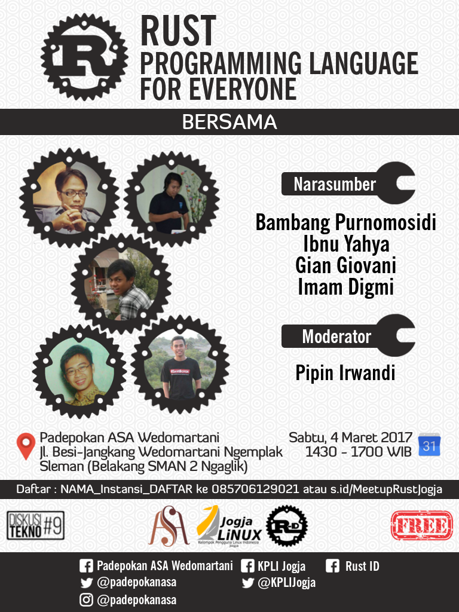

# Narasumber

1. Bambang Purnomosidi D. P [@bpdp](https://github.com/bpdp) (Membangun Aplikasi Web Menggunakan Rust)
2. Ibnu Yahya [@anak10thn](https://github.com/anak10thn) (FFI di Rust)
3. Gian Giovani [@wejick](https://github.com/wejick) (Search Engine - Elastic Search di Rust)
4. Imam Digmi [@imamdigmi](https://github.com/imamdigmi) (Konsep Dasar dan Getting Started)

Silahkan melihat ke masing-masing direktori untuk melihat slide dan mungkin juga contoh implementasi dari presentasi masing-masing presenter.

# Tempat

Padepokan ASA - Many thanks untuk mas Eki dan kru Padepokan ASA Wedomartani. 

# Waktu

Sabtu, 4 Maret 2017 - 14:30 sampai 17:30.

# Proposal Meetup

Terima kasih untuk KPLI - mas Pipin Irwandi - yang banyak membantu. [Proposal - format ODT](ProposalMeetupRustId2017.odt).

